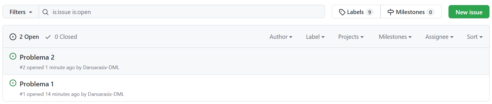
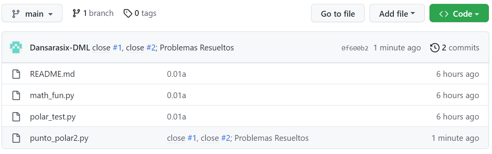

# Práctica 8: Issues

### Daniel Marín López

1. Creación de issues
2. Solución de issues

### Parte 1: Creación de issues

Nos vamos al repositorio de nuestro compañero y creamos un issue en una línea de código y otro informando que falta documentación.

Mientras en mi repositorio he asignado etiquetas para cada issue.

### Parte 2: Solución de issues

Ahora cerraremos los issues usando la terminal, primero "solucionamos" los errores introducidos y los subimos con git.

Y de esta forma se habrán cerrado los issues.

